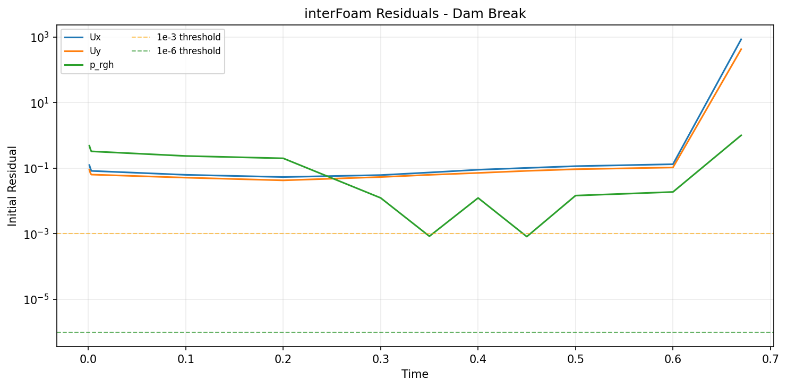
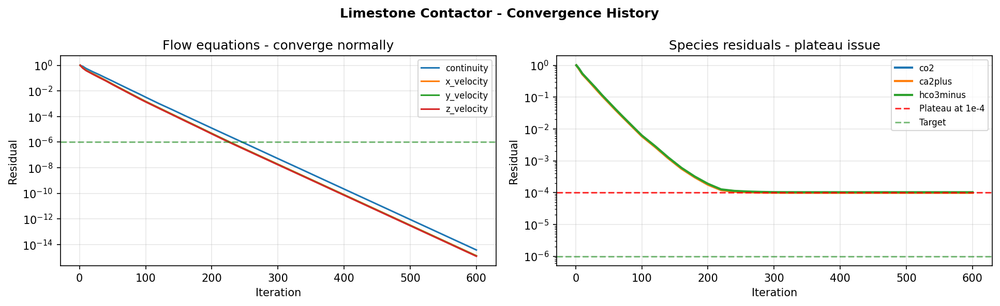

# CFD Simulation Assistant


A LangGraph-based assistant for reading CFD case files, plotting residuals, searching a curated CFD knowledge base, and drafting case reports.

## Why This Exists

CFD simulation files are full of structured information: solver settings, convergence logs, boundary conditions, numerical schemes, and material parameters. Diagnosing issues still requires domain expertise. This tool uses a LangGraph agent with RAG over a curated CFD knowledge base to help engineers understand their simulation files and debug convergence problems.

The project connects two parts of my engineering work: practical CFD setup and modern agent workflows. It is meant as a local assistant for inspection and explanation, not as an automatic solver tuner.

## Architecture

```text
+-------------------------------------------------------------------+
|                       CFD Simulation Assistant                     |
+-------------------------------------------------------------------+

  CLI / chat
      |
      v
  LangGraph ReAct agent
      |
      +--> parse_case_file ---------> OpenFOAM / Fluent parsers
      |
      +--> analyze_convergence -----> residual DataFrame + plots
      |
      +--> search_knowledge_base ---> FAISS index over knowledge_base/*.md
      |
      +--> generate_report ---------> Markdown case report
```

## Features

| Feature | What it does |
|---|---|
| OpenFOAM parsing | Reads `controlDict`, `fvSchemes`, `fvSolution`, `blockMeshDict`, and boundary files. |
| Fluent parsing | Extracts convergence histories and UDF-related setup notes from sample files. |
| Convergence analysis | Detects divergence, oscillation, and residual plateaus; exports plots. |
| Knowledge-base search | Retrieves local CFD notes on solvers, schemes, boundary conditions, UDFs, and common errors. |
| Report generation | Writes a Markdown summary for a case directory. |
| Agent interface | Routes questions through LangGraph tools with OpenAI or Anthropic backends. |

## Figures



OpenFOAM dam-break: oscillations in `p_rgh` (`t=0.3-0.6`), divergence at `t=0.67`.



Limestone contactor: species residuals plateau at `1e-4` while flow equations converge.

These are synthetic/sample logs, but the patterns are realistic enough to exercise the parser and diagnostic logic: transient pressure oscillation followed by divergence for `interFoam`, and stiff species convergence in a reactive porous-media Fluent setup.

## Installation

```bash
git clone https://github.com/abdou-elaoudi/cfd-simulation-assistant.git
cd cfd-simulation-assistant

python -m venv .venv
source .venv/bin/activate
pip install -r requirements.txt

cp .env.example .env
# Edit .env and set OPENAI_API_KEY or ANTHROPIC_API_KEY.

python -m app.rag.indexer
```

On Windows PowerShell:

```powershell
python -m venv .venv
.\.venv\Scripts\Activate.ps1
pip install -r requirements.txt
Copy-Item .env.example .env
python -m app.rag.indexer
```

## Usage

### 1. Chat mode

```bash
python -m app.main
```

### 2. Analyze one file

```bash
python -m app.main --analyze sample_cases/openfoam_dambreak/system/controlDict
python -m app.main --analyze sample_cases/openfoam_dambreak/system/fvSchemes
python -m app.main --analyze sample_cases/fluent_limestone/convergence_log.txt
```

### 3. Analyze a case directory

```bash
python -m app.main --case sample_cases/openfoam_dambreak/
```

### 4. Generate a report

```bash
python -m app.main --report sample_cases/openfoam_dambreak/ --output report.md
```

Select a model backend explicitly when needed:

```bash
python -m app.main --backend anthropic
python -m app.main --backend openai
```

## Example Conversations

```text
You > analyze the convergence log at sample_cases/openfoam_dambreak/logs/interFoam.log

Assistant > I analyzed the interFoam convergence log.

  OSCILLATIONS detected in p_rgh residuals from time 0.30 to 0.65 s.
  The residual alternates between about 1.2e-2 and 8.4e-4.

  DIVERGENCE detected at time = 0.67 s.
  Ux residual jumped from 0.08 to 847.3, followed by a NaN cascade.

  Suggested checks:
  1. Reduce maxCo from 0.9 to 0.5 in controlDict.
  2. Try PCG+DIC for p_rgh if GAMG stalls near the free surface.
  3. Add nNonOrthogonalCorrectors 1 in the PIMPLE dictionary if mesh non-orthogonality is high.
  4. Run checkMesh before restarting.

You > what does vanLeer mean in fvSchemes?

Assistant > vanLeer is a TVD flux-limiter scheme often used for VOF phase fraction advection.
For an interFoam dam-break case it is commonly used as:

    div(phi,alpha)    Gauss vanLeer;

It is less diffusive than first-order upwind while still limiting overshoot in alpha.

You > my limestone contactor simulation has species residuals stuck at 1e-4

Assistant > The knowledge base points to a calcocarbonic coupling issue.

Likely checks:
  1. Lower species under-relaxation to 0.3-0.5.
  2. Ensure DEFINE_ADJUST updates pH before the species equations.
  3. Check UDS scaling against the source-term magnitude.
  4. Review porous-media resistance coefficients if transport is becoming diffusion dominated.
```

## Knowledge Base

| File | Content |
|---|---|
| `openfoam_docs/solvers.md` | `interFoam`, `simpleFoam`, `pimpleFoam`, `rhoPimpleFoam` notes. |
| `openfoam_docs/boundary_conditions.md` | Common OpenFOAM boundary condition choices and mistakes. |
| `openfoam_docs/fvSchemes_guide.md` | Time, gradient, divergence, and interpolation scheme notes. |
| `openfoam_docs/common_errors.md` | Runtime errors, symptoms, and practical checks. |
| `fluent_docs/udf_guide.md` | `DEFINE_SOURCE`, `DEFINE_INIT`, `DEFINE_ADJUST`, UDS, and UDM notes. |
| `fluent_docs/porous_media.md` | Darcy-Forchheimer setup and resistance coefficients. |
| `fluent_docs/species_transport.md` | Species equations and calcocarbonic-equilibrium notes. |

## Running Tests

```bash
pytest tests/ -v
```

## Limitations

| Limitation | Detail |
|---|---|
| Local knowledge base | The assistant only knows what is in `knowledge_base/` plus the selected LLM backend. |
| No solver execution | It reads files and logs; it does not run OpenFOAM or Fluent. |
| Heuristic diagnostics | Residual classification is based on patterns and thresholds, so conclusions need engineering review. |
| API key required for chat | Parser and plotting utilities are local; the agent chat path needs an LLM backend. |

## License

MIT. See [LICENSE](LICENSE).
